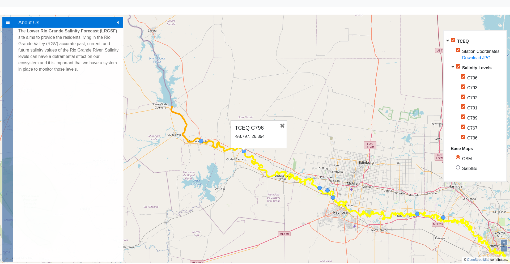

# Lower Rio Grande Salinity Forecast
Website to display TCEQ sites in the Rio Grande Valley and show the lower Rio Grande salinity forecast (LRGSF) levels.



The website will be accessible through https://lrgsf.utrgv.edu.

## Installation

The LRGSF app salinity-site is designed to run on a Linux machine. To run the salinity-site you first need to install the following software.
* NodeJs
* MySQL

### NodeJs

To install NodeJs you need to follow the steps found here https://nodejs.dev/learn/how-to-install-nodejs.
If you are running Ubuntu you can execute the following commands.
```bash
sudo apt update
sudo apt install nodejs
sudo apt install npm
```

Once you have installed NodeJs, go ahead and clone the salinity-site repository. Once cloned, using your preferred text editor open up the src/app.js file and uncomment the first line and commend out the second line. This is because the default environment path is hardcoded to match the servers .env path and will not match your local computer's path.

Next, oepn up your terminal and navigate into the project home directory where the package.json and package-lock.json files are found and run the following commands.
```bash
npm install
```
Once all packages have been installed run the development bash script to build the website using the following.
```bash
npm run dev
```
Once you see 2 green built messages, end the command using cntrl+c and start the website using the following.
```bash
npm start
```

Open up your browser and go to http://localhost:3000 to view the salinity-site or LRGSF website running on your local computer.

### MySQL

To install MySQL you need to follow the steps found here https://www.geeksforgeeks.org/how-to-install-mysql-on-linux/.
If you are running Ubuntu you can execute the following commands.
```bash
sudo apt install mysql-server
sudo mysql_secure_installation
```
Follow the prompted instructions to set up your MySQL server.
